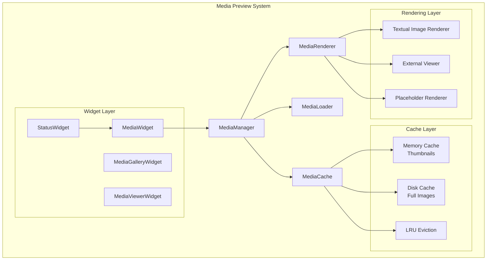
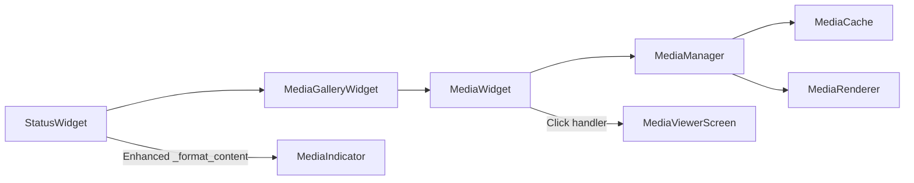

# Tootles Media Preview System Architecture Design

## Executive Summary

This design implements a modern media preview system for tootles that prioritizes in-terminal image display using Textual's native capabilities with external viewer fallback, and employs smart caching with memory for thumbnails and disk storage for full-size images.

## Current State Analysis

### Existing Architecture Strengths
- **Modern Textual Framework**: Already using Textual 0.45.0+ with rich widget system
- **Modular Design**: Clear separation between widgets, API, and configuration
- **Media-Aware Models**: `MediaAttachment` model already supports all Mastodon media types
- **Configuration System**: Existing `show_media_previews` setting in schema
- **Status Widget Foundation**: Current status widget shows media indicators

### Gaps to Address
- No in-terminal media display capabilities
- Basic media indicators only (text-based)
- No caching system for media
- No async media loading
- Limited error handling for media operations

## Architecture Overview



## Module Structure and File Organization

```
tootles/
├── media/
│   ├── __init__.py
│   ├── manager.py          # MediaManager - main orchestrator
│   ├── cache.py            # Smart caching system
│   ├── loader.py           # Async media loading
│   ├── renderer.py         # Media rendering logic
│   ├── formats.py          # Format detection and validation
│   └── external.py         # External viewer integration
├── widgets/
│   ├── media/
│   │   ├── __init__.py
│   │   ├── widget.py       # MediaWidget - inline preview
│   │   ├── gallery.py      # MediaGalleryWidget - multiple media
│   │   ├── viewer.py       # MediaViewerWidget - full-screen
│   │   └── placeholder.py  # Loading/error placeholders
│   └── status.py           # Enhanced with media integration
├── config/
│   └── schema.py           # Extended media configuration
└── utils/
    └── media.py            # Media utilities and helpers
```

## Core Components Design

### 1. MediaManager (media/manager.py)

```python
class MediaManager:
    """Central coordinator for all media operations"""
    
    def __init__(self, config: TootlesConfig, cache: MediaCache):
        self.config = config
        self.cache = cache
        self.loader = MediaLoader(cache)
        self.renderer = MediaRenderer(config)
    
    async def get_media_widget(self, attachment: MediaAttachment) -> Widget:
        """Get appropriate widget for media attachment"""
        
    async def preload_media(self, attachments: List[MediaAttachment]) -> None:
        """Preload media for better UX"""
        
    def get_supported_formats(self) -> Dict[str, List[str]]:
        """Get supported media formats by type"""
```

### 2. Smart Caching System (media/cache.py)

```python
class MediaCache:
    """Smart caching with memory/disk tiers"""
    
    def __init__(self, config: MediaCacheConfig):
        self.memory_cache = LRUCache(maxsize=config.memory_cache_size)
        self.disk_cache = DiskCache(config.cache_directory)
        self.thumbnail_cache = LRUCache(maxsize=config.thumbnail_cache_size)
    
    async def get_thumbnail(self, url: str) -> Optional[bytes]:
        """Get thumbnail from memory cache"""
        
    async def get_full_image(self, url: str) -> Optional[bytes]:
        """Get full image from disk cache with memory fallback"""
        
    async def store_media(self, url: str, data: bytes, is_thumbnail: bool = False):
        """Store media with appropriate caching strategy"""
```

### 3. Media Rendering (media/renderer.py)

```python
class MediaRenderer:
    """Handles different rendering strategies"""
    
    def __init__(self, config: TootlesConfig):
        self.config = config
        self.textual_renderer = TextualImageRenderer()
        self.external_viewer = ExternalViewerManager(config.external_viewers)
    
    async def render_inline(self, attachment: MediaAttachment) -> Widget:
        """Render media inline in timeline"""
        
    async def render_fullscreen(self, attachment: MediaAttachment) -> Widget:
        """Render media in fullscreen viewer"""
        
    async def open_external(self, attachment: MediaAttachment) -> None:
        """Open media in external application"""
```

### 4. Enhanced Status Widget Integration

```python
class StatusWidget(Widget):
    """Enhanced with media preview capabilities"""
    
    def compose(self) -> ComposeResult:
        # ... existing code ...
        
        # Enhanced media section
        if display_status.media_attachments and self.config.show_media_previews:
            yield MediaGalleryWidget(
                attachments=display_status.media_attachments,
                media_manager=self.app_ref.media_manager
            )
```

## API Design for Media Handling

### MediaWidget API

```python
class MediaWidget(Widget):
    """Individual media preview widget"""
    
    def __init__(
        self,
        attachment: MediaAttachment,
        media_manager: MediaManager,
        size: MediaSize = MediaSize.THUMBNAIL,
        **kwargs
    ):
        
    async def load_preview(self) -> None:
        """Async load media preview"""
        
    def action_view_fullscreen(self) -> None:
        """Open fullscreen media viewer"""
        
    def action_open_external(self) -> None:
        """Open in external application"""
```

### MediaGalleryWidget API

```python
class MediaGalleryWidget(Widget):
    """Gallery for multiple media attachments"""
    
    def __init__(
        self,
        attachments: List[MediaAttachment],
        media_manager: MediaManager,
        layout: GalleryLayout = GalleryLayout.GRID,
        **kwargs
    ):
        
    async def preload_all(self) -> None:
        """Preload all media in gallery"""
        
    def action_navigate_media(self, direction: str) -> None:
        """Navigate between media items"""
```

## Configuration Schema Updates

```python
@dataclass
class MediaConfig:
    """Media-specific configuration"""
    
    # Display settings
    show_media_previews: bool = True
    inline_image_max_height: int = 20  # Terminal rows
    thumbnail_size: Tuple[int, int] = (150, 150)  # Pixels
    
    # Cache settings
    memory_cache_size: int = 50  # MB for thumbnails
    disk_cache_size: int = 500   # MB for full images
    cache_directory: str = "~/.cache/tootles/media"
    cache_expiry_days: int = 7
    
    # External viewers
    external_viewers: Dict[str, str] = field(default_factory=lambda: {
        "image": "feh",
        "video": "mpv",
        "audio": "mpv"
    })
    
    # Format support
    supported_image_formats: List[str] = field(default_factory=lambda: [
        "jpg", "jpeg", "png", "gif", "webp", "svg"
    ])
    supported_video_formats: List[str] = field(default_factory=lambda: [
        "mp4", "webm", "mov", "avi"
    ])
    supported_audio_formats: List[str] = field(default_factory=lambda: [
        "mp3", "ogg", "wav", "m4a"
    ])

@dataclass
class TootlesConfig:
    # ... existing fields ...
    media: MediaConfig = field(default_factory=MediaConfig)
```

## Integration Points with Existing Widgets

### Status Widget Integration



### Timeline Widget Integration

```python
class Timeline(Widget):
    """Enhanced with media preloading"""
    
    async def on_mount(self) -> None:
        # ... existing code ...
        if self.config.media.show_media_previews:
            await self._preload_visible_media()
    
    async def _preload_visible_media(self) -> None:
        """Preload media for visible statuses"""
        for status_widget in self.get_visible_status_widgets():
            if status_widget.status.media_attachments:
                await self.app.media_manager.preload_media(
                    status_widget.status.media_attachments
                )
```

## Dependencies and Requirements

### New Dependencies

```toml
# Add to pyproject.toml dependencies
dependencies = [
    # ... existing dependencies ...
    "pillow>=10.0.0",           # Enhanced image processing
    "aiofiles>=23.0.0",         # Async file operations
    "diskcache>=5.6.0",         # Disk caching
    "python-magic>=0.4.27",     # File type detection
]

[project.optional-dependencies]
media = [
    "term-image>=0.7.0",        # Terminal image display
    "textual-imageview>=0.1.0", # Textual image widgets
]
```

### System Requirements

- **Terminal Support**: Kitty, iTerm2, or terminals with image support
- **External Viewers**: Optional feh, mpv, or user-configured applications
- **Storage**: Configurable cache directory with disk space management

## Implementation Phases

### Phase 1: Foundation (Week 1)
- [ ] Create media module structure
- [ ] Implement basic MediaManager and MediaCache
- [ ] Add media configuration to schema
- [ ] Create placeholder MediaWidget

### Phase 2: Core Functionality (Week 2)
- [ ] Implement async media loading
- [ ] Create smart caching system
- [ ] Build basic in-terminal image rendering
- [ ] Integrate with StatusWidget

### Phase 3: Enhanced Features (Week 3)
- [ ] Implement MediaGalleryWidget
- [ ] Add fullscreen MediaViewerWidget
- [ ] Create external viewer integration
- [ ] Add media preloading

### Phase 4: Polish & Optimization (Week 4)
- [ ] Implement error handling and fallbacks
- [ ] Add performance optimizations
- [ ] Create comprehensive tests
- [ ] Add accessibility features

## Error Handling Strategy

```python
class MediaError(Exception):
    """Base media error"""

class MediaLoadError(MediaError):
    """Failed to load media"""

class MediaRenderError(MediaError):
    """Failed to render media"""

class MediaCacheError(MediaError):
    """Cache operation failed"""

# Graceful degradation strategy
async def safe_media_render(attachment: MediaAttachment) -> Widget:
    try:
        return await render_media(attachment)
    except MediaLoadError:
        return create_load_error_placeholder(attachment)
    except MediaRenderError:
        return create_render_error_placeholder(attachment)
    except Exception:
        return create_generic_error_placeholder(attachment)
```

## Performance Considerations

1. **Lazy Loading**: Media loaded only when visible
2. **Smart Preloading**: Preload media for next/previous statuses
3. **Memory Management**: LRU eviction for memory caches
4. **Disk Management**: Automatic cleanup of old cache files
5. **Async Operations**: Non-blocking media operations
6. **Format Optimization**: Automatic thumbnail generation

## Accessibility Features

1. **Alt Text Support**: Display media descriptions
2. **Keyboard Navigation**: Full keyboard control
3. **Screen Reader Support**: Proper ARIA labels
4. **High Contrast**: Respect system accessibility settings
5. **Configurable Sizes**: Adjustable preview sizes

## Technical Implementation Notes

### Key Design Decisions

1. **Smart Caching Strategy**: Memory for thumbnails (fast access), disk for full images (persistent storage)
2. **Textual-First Approach**: Prioritize native Textual capabilities with external fallback
3. **Async Architecture**: Non-blocking media operations to maintain UI responsiveness
4. **Modular Design**: Clear separation of concerns for maintainability
5. **Graceful Degradation**: Fallback strategies for unsupported formats or failed operations

### Integration with Existing Codebase

- **StatusWidget Enhancement**: Minimal changes to existing status display logic
- **Configuration Extension**: Backward-compatible media configuration additions
- **API Client Reuse**: Leverage existing httpx-based async client for media downloads
- **Theme Compatibility**: Media widgets respect existing CSS theming system

This architecture provides a robust, performant, and user-friendly media preview system that significantly enhances the tootles user experience while maintaining the application's modern, clean design principles.