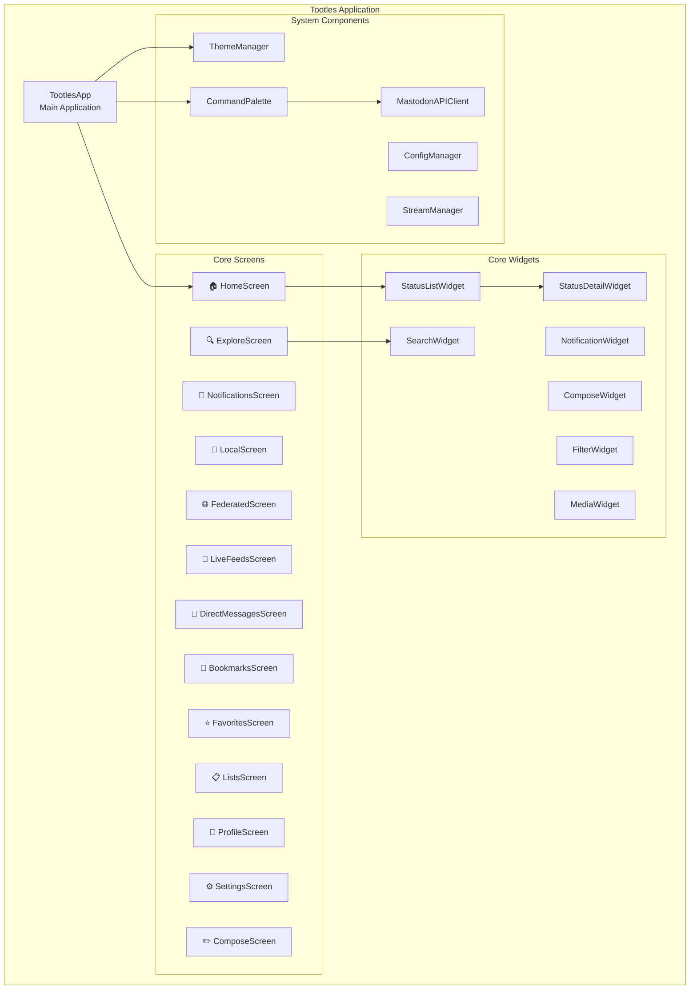
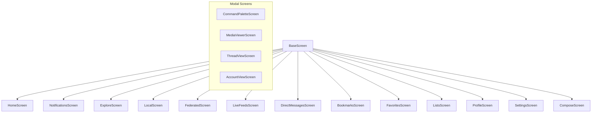
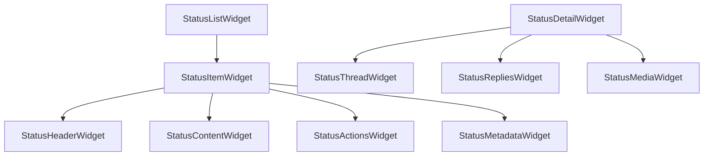
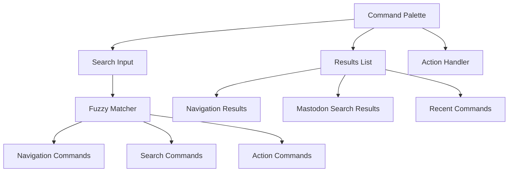

# Tootles Architecture Specification

**Tootles** - A modern Textual-based Mastodon client with web UI parity and advanced theming

## Table of Contents

1. [Project Overview](#project-overview)
2. [Architecture Overview](#architecture-overview)
3. [Project Structure](#project-structure)
4. [Screen Architecture](#screen-architecture)
5. [Widget Hierarchy](#widget-hierarchy)
6. [Theme System](#theme-system)
7. [Fuzzy Search Command Palette](#fuzzy-search-command-palette)
8. [API Integration](#api-integration)
9. [Implementation Phases](#implementation-phases)
10. [Technical Specifications](#technical-specifications)

## Project Overview

Tootles is a hard fork of the toot Mastodon CLI client, migrating from urwid to Textual framework with complete web UI parity. Key features:

- **Web UI Alignment**: All major Mastodon web sections (Home, Notifications, Explore, etc.)
- **Modern CSS Theming**: Community-driven theme repository with hot-reload
- **Fuzzy Search**: Command palette for quick navigation and Mastodon search
- **Real-time Updates**: Live feeds with streaming timeline updates
- **Enhanced UX**: Textual-native interactions and animations

## Architecture Overview



## Project Structure

```
tootles/
├── pyproject.toml                 # Project configuration
├── README.md                      # Project documentation
├── ARCHITECTURE.md               # This file
├── tootles/
│   ├── __init__.py
│   ├── main.py                   # Entry point
│   ├── app.py                    # Main TootlesApp class
│   ├── config/
│   │   ├── __init__.py
│   │   ├── manager.py            # Configuration management
│   │   ├── defaults.py           # Default settings
│   │   └── schema.py             # Config validation
│   ├── screens/
│   │   ├── __init__.py
│   │   ├── base.py               # Base screen class
│   │   ├── home.py               # Home timeline
│   │   ├── notifications.py     # Notifications with filtering
│   │   ├── explore.py            # Trending, news, discovery
│   │   ├── local.py              # Local timeline
│   │   ├── federated.py          # Federated timeline
│   │   ├── live_feeds.py         # Real-time streaming
│   │   ├── direct_messages.py    # Private mentions/DMs
│   │   ├── bookmarks.py          # Bookmarked posts
│   │   ├── favorites.py          # Favorited posts
│   │   ├── lists.py              # User lists
│   │   ├── profile.py            # User profiles
│   │   ├── settings.py           # App settings
│   │   └── compose.py            # Status composition
│   ├── widgets/
│   │   ├── __init__.py
│   │   ├── base.py               # Base widget classes
│   │   ├── status/
│   │   │   ├── __init__.py
│   │   │   ├── list.py           # Status list widget
│   │   │   ├── detail.py         # Status detail widget
│   │   │   ├── item.py           # Individual status item
│   │   │   └── thread.py         # Thread view widget
│   │   ├── notifications/
│   │   │   ├── __init__.py
│   │   │   ├── list.py           # Notification list
│   │   │   ├── item.py           # Notification item
│   │   │   └── filters.py        # Notification filters
│   │   ├── compose/
│   │   │   ├── __init__.py
│   │   │   ├── editor.py         # Text editor
│   │   │   ├── media.py          # Media attachments
│   │   │   └── options.py        # Visibility, CW, etc.
│   │   ├── search/
│   │   │   ├── __init__.py
│   │   │   ├── palette.py        # Command palette
│   │   │   ├── results.py        # Search results
│   │   │   └── filters.py        # Search filters
│   │   ├── media/
│   │   │   ├── __init__.py
│   │   │   ├── viewer.py         # Media viewer
│   │   │   └── gallery.py        # Media gallery
│   │   └── common/
│   │       ├── __init__.py
│   │       ├── navigation.py     # Navigation sidebar
│   │       ├── header.py         # App header
│   │       ├── footer.py         # Status footer
│   │       └── loading.py        # Loading indicators
│   ├── api/
│   │   ├── __init__.py
│   │   ├── client.py             # Mastodon API client
│   │   ├── models.py             # Data models
│   │   ├── streaming.py          # Real-time streaming
│   │   └── cache.py              # Response caching
│   ├── themes/
│   │   ├── __init__.py
│   │   ├── manager.py            # Theme management
│   │   ├── loader.py             # CSS loading
│   │   ├── validator.py          # Theme validation
│   │   ├── builtin/              # Built-in themes
│   │   │   ├── default.css
│   │   │   ├── dark.css
│   │   │   ├── light.css
│   │   │   └── high_contrast.css
│   │   └── user/                 # User themes directory
│   ├── utils/
│   │   ├── __init__.py
│   │   ├── formatting.py         # Text formatting
│   │   ├── media.py              # Media handling
│   │   ├── time.py               # Time utilities
│   │   └── validation.py         # Input validation
│   └── cli/
│       ├── __init__.py
│       └── main.py               # CLI interface
├── themes-community/             # Community themes repository
│   ├── README.md
│   ├── CONTRIBUTING.md
│   ├── themes/
│   │   ├── cyberpunk.css
│   │   ├── solarized.css
│   │   ├── nord.css
│   │   └── ...
│   └── examples/
│       ├── theme-template.css
│       └── color-palette.md
└── tests/
    ├── __init__.py
    ├── test_screens/
    ├── test_widgets/
    ├── test_api/
    └── test_themes/
```

## Screen Architecture

### Base Screen Pattern

```python
class BaseScreen(Screen):
    """Base class for all tootles screens"""
    
    BINDINGS = [
        ("ctrl+p", "command_palette", "Search"),
        ("ctrl+r", "refresh", "Refresh"),
        ("escape", "back", "Back"),
    ]
    
    def __init__(self, app_context: AppContext):
        super().__init__()
        self.app_context = app_context
        self.api = app_context.api
        self.config = app_context.config
        self.theme_manager = app_context.theme_manager
    
    def action_command_palette(self) -> None:
        """Open fuzzy search command palette"""
        self.app.push_screen(CommandPaletteScreen())
    
    def action_refresh(self) -> None:
        """Refresh current screen content"""
        pass  # Override in subclasses
```

### Screen Hierarchy



### Key Screen Implementations

#### HomeScreen
- Main timeline with following posts
- Real-time updates via streaming
- Infinite scroll with pagination
- Status interaction (boost, favorite, reply)

#### NotificationsScreen
- Filtered notification types (mentions, favorites, boosts, follows, polls)
- Grouped notifications by type
- Mark as read functionality
- Quick action buttons

#### ExploreScreen
- Trending posts, hashtags, news
- User discovery suggestions
- Search functionality
- Content filtering options

#### LiveFeedsScreen
- Real-time streaming timelines
- Multiple feed support
- Auto-refresh controls
- Performance optimizations

## Widget Hierarchy

### Status Display Widgets



### Core Widget Specifications

#### StatusListWidget
```python
class StatusListWidget(ScrollableContainer):
    """Scrollable list of status items with infinite loading"""
    
    def __init__(self, timeline_type: str, api_client: APIClient):
        super().__init__()
        self.timeline_type = timeline_type
        self.api = api_client
        self.statuses: List[Status] = []
        self.loading = False
    
    async def load_more(self) -> None:
        """Load more statuses when scrolling near bottom"""
        
    def add_status(self, status: Status) -> None:
        """Add new status to top of list"""
        
    def update_status(self, status: Status) -> None:
        """Update existing status in place"""
        
    def remove_status(self, status_id: str) -> None:
        """Remove status from list"""
```

#### NotificationWidget
```python
class NotificationWidget(Container):
    """Individual notification display with type-specific rendering"""
    
    def __init__(self, notification: Notification):
        super().__init__()
        self.notification = notification
        self.render_by_type()
    
    def render_by_type(self) -> None:
        """Render notification based on type (mention, favorite, etc.)"""
        
    def mark_as_read(self) -> None:
        """Mark notification as read"""
```

## Theme System

### CSS Architecture

The theme system uses Textual's CSS capabilities with a hierarchical structure:

```css
/* Base layout components */
.app-container { }
.screen-container { }
.sidebar-navigation { }
.main-content { }
.status-bar { }

/* Navigation elements */
.nav-item { }
.nav-item--active { }
.nav-item--home { }
.nav-item--notifications { }
.nav-item--explore { }

/* Status display */
.status-list { }
.status-item { }
.status-item--focused { }
.status-header { }
.status-content { }
.status-actions { }
.status-metadata { }

/* Notifications */
.notification-list { }
.notification-item { }
.notification-item--mention { }
.notification-item--favorite { }
.notification-item--boost { }
.notification-item--follow { }

/* Interactive elements */
.button { }
.button--primary { }
.button--secondary { }
.button--danger { }
.input-field { }
.search-box { }

/* Media display */
.media-container { }
.media-image { }
.media-video { }
.media-gallery { }

/* Command palette */
.command-palette { }
.command-palette-input { }
.command-palette-results { }
.command-palette-item { }
.command-palette-item--selected { }
```

### Theme Manager

```python
class ThemeManager:
    """Manages theme loading, validation, and hot-reload"""
    
    def __init__(self, config: ConfigManager):
        self.config = config
        self.current_theme = None
        self.builtin_themes = self._load_builtin_themes()
        self.user_themes = self._load_user_themes()
        self.community_themes = self._load_community_themes()
    
    def load_theme(self, theme_name: str) -> Theme:
        """Load and validate theme by name"""
        
    def apply_theme(self, theme: Theme) -> None:
        """Apply theme to application"""
        
    def reload_theme(self) -> None:
        """Hot-reload current theme (for development)"""
        
    def validate_theme(self, theme_path: Path) -> bool:
        """Validate theme CSS and structure"""
```

### Community Theme Repository

Structure for `themes-community/` repository:

```
themes-community/
├── README.md                     # Theme repository documentation
├── CONTRIBUTING.md              # Contribution guidelines
├── THEME_SPEC.md               # Theme specification
├── themes/
│   ├── cyberpunk/
│   │   ├── theme.css           # Main theme file
│   │   ├── preview.png         # Theme preview image
│   │   └── README.md           # Theme description
│   ├── solarized/
│   │   ├── theme.css
│   │   ├── preview.png
│   │   └── README.md
│   └── nord/
│       ├── theme.css
│       ├── preview.png
│       └── README.md
├── examples/
│   ├── theme-template.css      # Template for new themes
│   ├── color-variables.css     # CSS custom properties
│   └── component-guide.md      # Component styling guide
└── tools/
    ├── validate-theme.py       # Theme validation script
    └── generate-preview.py     # Preview generation
```

## Fuzzy Search Command Palette

### Command Palette Architecture



### Command Types

#### Navigation Commands
```python
NAVIGATION_COMMANDS = [
    Command("home", "🏠 Home Timeline", action="goto_home"),
    Command("notifications", "🔔 Notifications", action="goto_notifications"),
    Command("explore", "🔍 Explore", action="goto_explore"),
    Command("local", "📍 Local Timeline", action="goto_local"),
    Command("federated", "🌐 Federated Timeline", action="goto_federated"),
    Command("bookmarks", "📖 Bookmarks", action="goto_bookmarks"),
    Command("favorites", "⭐ Favorites", action="goto_favorites"),
    Command("lists", "📋 Lists", action="goto_lists"),
    Command("profile", "👤 Profile", action="goto_profile"),
    Command("settings", "⚙️ Settings", action="goto_settings"),
    Command("compose", "✏️ Compose", action="goto_compose"),
]
```

#### Search Commands
```python
SEARCH_COMMANDS = [
    Command("search users", "👥 Search Users", action="search_users"),
    Command("search hashtags", "🏷️ Search Hashtags", action="search_hashtags"),
    Command("search posts", "📝 Search Posts", action="search_posts"),
    Command("search accounts", "👤 Search Accounts", action="search_accounts"),
]
```

#### Action Commands
```python
ACTION_COMMANDS = [
    Command("refresh", "🔄 Refresh Timeline", action="refresh_timeline"),
    Command("toggle theme", "🎨 Toggle Theme", action="toggle_theme"),
    Command("reload themes", "🔄 Reload Themes", action="reload_themes"),
    Command("clear cache", "🗑️ Clear Cache", action="clear_cache"),
]
```

### Fuzzy Matching Implementation

```python
class FuzzyMatcher:
    """Fuzzy string matching for command palette"""
    
    def __init__(self):
        self.commands = self._load_all_commands()
    
    def search(self, query: str) -> List[CommandResult]:
        """Perform fuzzy search on commands and return ranked results"""
        results = []
        
        for command in self.commands:
            score = self._calculate_score(query, command)
            if score > 0:
                results.append(CommandResult(command, score))
        
        # Sort by score (highest first)
        results.sort(key=lambda x: x.score, reverse=True)
        return results[:10]  # Return top 10 results
    
    def _calculate_score(self, query: str, command: Command) -> float:
        """Calculate fuzzy match score using multiple factors"""
        # Implement fuzzy matching algorithm
        # Consider: exact matches, substring matches, character order, etc.
```

### Mastodon Search Integration

```python
class MastodonSearchProvider:
    """Provides Mastodon search results for command palette"""
    
    def __init__(self, api_client: APIClient):
        self.api = api_client
        self.cache = {}
    
    async def search(self, query: str, search_type: str = "all") -> List[SearchResult]:
        """Search Mastodon for users, hashtags, or posts"""
        
        # Cache recent searches
        cache_key = f"{search_type}:{query}"
        if cache_key in self.cache:
            return self.cache[cache_key]
        
        results = await self.api.search(
            query=query,
            type=search_type,
            resolve=True,
            limit=10
        )
        
        self.cache[cache_key] = results
        return results
```

## API Integration

### API Client Architecture

```python
class MastodonAPIClient:
    """Enhanced Mastodon API client with caching and streaming"""
    
    def __init__(self, instance_url: str, access_token: str):
        self.instance_url = instance_url
        self.access_token = access_token
        self.session = aiohttp.ClientSession()
        self.cache = APICache()
        self.rate_limiter = RateLimiter()
    
    async def get_timeline(self, timeline_type: str, **params) -> List[Status]:
        """Get timeline with caching and rate limiting"""
        
    async def stream_timeline(self, timeline_type: str) -> AsyncIterator[Status]:
        """Stream real-time timeline updates"""
        
    async def search(self, query: str, **params) -> SearchResults:
        """Search Mastodon content"""
        
    async def post_status(self, content: str, **params) -> Status:
        """Post new status"""
```

### Real-time Streaming

```python
class StreamManager:
    """Manages real-time streaming connections"""
    
    def __init__(self, api_client: MastodonAPIClient):
        self.api = api_client
        self.active_streams = {}
        self.event_handlers = {}
    
    async def start_stream(self, stream_type: str, handler: Callable):
        """Start streaming for timeline type"""
        
    async def stop_stream(self, stream_type: str):
        """Stop streaming for timeline type"""
        
    def register_handler(self, event_type: str, handler: Callable):
        """Register event handler for stream events"""
```

## Implementation Phases

### Phase 1: Foundation (Weeks 1-2)
**Goal**: Basic Textual application with core screens

**Tasks**:
- [ ] Set up project structure and dependencies
- [ ] Implement base application class and screen system
- [ ] Create basic navigation between screens
- [ ] Implement configuration management
- [ ] Set up basic CSS theming foundation
- [ ] Migrate home timeline functionality from toot

**Deliverables**:
- Working Textual application
- Home timeline with basic status display
- Navigation between core screens
- Basic theme system

### Phase 2: Core Features (Weeks 3-4)
**Goal**: Implement all major screens with basic functionality

**Tasks**:
- [ ] Implement notifications screen with filtering
- [ ] Create explore screen with trending content
- [ ] Add bookmarks and favorites screens
- [ ] Implement lists and profile screens
- [ ] Create compose screen for posting
- [ ] Add basic search functionality

**Deliverables**:
- All major screens functional
- Status interaction (boost, favorite, reply)
- Basic search capabilities
- Compose functionality

### Phase 3: Advanced Features (Weeks 5-6)
**Goal**: Add advanced features and polish

**Tasks**:
- [ ] Implement fuzzy search command palette
- [ ] Add real-time streaming for live feeds
- [ ] Create enhanced media viewer
- [ ] Implement thread view
- [ ] Add direct messages/private mentions
- [ ] Enhance notification system

**Deliverables**:
- Command palette with fuzzy search
- Real-time timeline updates
- Enhanced media handling
- Thread conversations
- Direct messaging

### Phase 4: Theming & Community (Weeks 7-8)
**Goal**: Complete theming system and community features

**Tasks**:
- [ ] Finalize CSS theming system
- [ ] Create built-in theme collection
- [ ] Set up community theme repository
- [ ] Implement theme hot-reload
- [ ] Add theme validation and preview
- [ ] Create documentation and examples

**Deliverables**:
- Complete theming system
- Community theme repository
- Theme development tools
- Comprehensive documentation

## Technical Specifications

### Dependencies

```toml
[project]
name = "tootles"
dependencies = [
    "textual>=0.45.0",
    "aiohttp>=3.8.0",
    "click>=8.1.0",
    "tomlkit>=0.12.0",
    "python-dateutil>=2.8.0",
    "beautifulsoup4>=4.11.0",
    "pillow>=9.0.0",  # For image handling
    "fuzzywuzzy>=0.18.0",  # For fuzzy search
    "python-levenshtein>=0.20.0",  # Fast fuzzy matching
]

[project.optional-dependencies]
dev = [
    "pytest>=7.0.0",
    "pytest-asyncio>=0.21.0",
    "black>=22.0.0",
    "mypy>=1.0.0",
    "textual-dev>=1.0.0",  # For theme development
]
```

### Configuration Schema

```python
@dataclass
class TootlesConfig:
    """Main configuration structure"""
    
    # Instance settings
    instance_url: str
    access_token: str
    
    # UI settings
    theme: str = "default"
    auto_refresh: bool = True
    refresh_interval: int = 60
    show_media_previews: bool = True
    
    # Timeline settings
    timeline_limit: int = 40
    enable_streaming: bool = True
    mark_notifications_read: bool = True
    
    # Search settings
    search_history_size: int = 100
    enable_fuzzy_search: bool = True
    
    # Theme settings
    theme_directory: str = "~/.config/tootles/themes"
    enable_theme_hot_reload: bool = False
    
    # Advanced settings
    cache_size: int = 1000
    rate_limit_requests: int = 300
    rate_limit_window: int = 300
```

### Performance Considerations

1. **Lazy Loading**: Load content as needed to reduce memory usage
2. **Caching**: Cache API responses and media to reduce network requests
3. **Streaming**: Use WebSocket streaming for real-time updates
4. **Pagination**: Implement efficient pagination for large timelines
5. **Image Optimization**: Compress and cache media previews
6. **Rate Limiting**: Respect Mastodon API rate limits

### Accessibility Features

1. **Keyboard Navigation**: Full keyboard support for all features
2. **Screen Reader Support**: Proper ARIA labels and descriptions
3. **High Contrast Themes**: Built-in accessibility themes
4. **Configurable Font Sizes**: Adjustable text sizing
5. **Color Blind Support**: Color-blind friendly color schemes

### Security Considerations

1. **Token Storage**: Secure storage of access tokens
2. **Input Validation**: Sanitize all user inputs
3. **Content Filtering**: Support for content warnings and filters
4. **Privacy Settings**: Respect user privacy preferences
5. **Secure Connections**: HTTPS-only API connections

---

This architecture specification provides a comprehensive foundation for implementing Tootles as a modern, feature-rich Mastodon client with web UI parity and advanced theming capabilities.